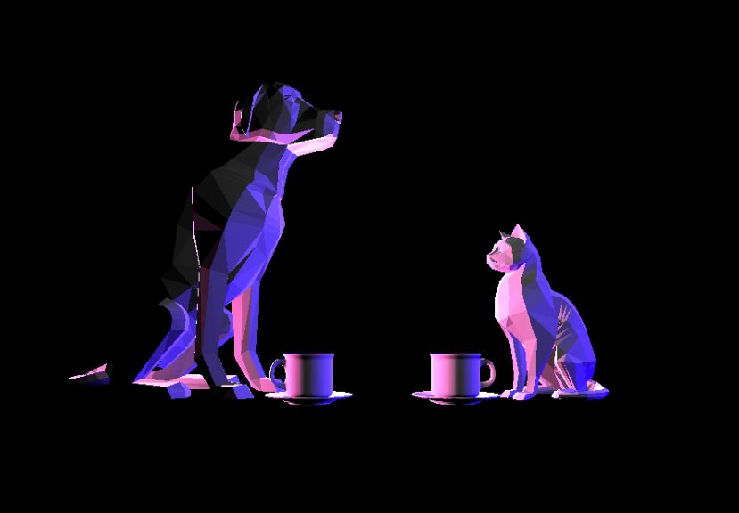

# CMPM163Labs

<b>Lab 4</b>
a. x = u x 7  
b. y = v x -7 + 7
c. (2.625,5.25) = gray

[Link to video](https://drive.google.com/file/d/1bo_ADo5jxJRgCFgc9_9M-fvdPf7ahkXf/view?usp=sharing)  
From left to right:
1. 2nd chosen texture and normal map  
2. 1st chosen texture  
3. 1st chosen texture and normal map  
These three were done in the same way, using three.js built in functionality.  
4. Shader loaded texture  
5. Tiled shader loaded texture  
These two were loaded using shader files. I solved the tile issue by using the built-in mod function.  

<b>Lab 3</b>

[Link to video](https://drive.google.com/file/d/1mI6X_eOP5UXOTJIeI3NRfMBDfFhOcWyP/view?usp=sharing)  
Top left     : Basic material with wireframe true and color pink  
Top right    : Normal material  
Center       : Phong material with green specular highlight  
Bottom Left  : Shaders interpolating between default colors and z-axis  
Bottom Right : Shaders interpolating between blue, purple and y-zxis  

<b>Lab 2</b>

[Link to video](https://drive.google.com/file/d/1NeADZKp8pNPdYFGvxcBc9fCCv-Py1t9W/view?usp=sharing)

