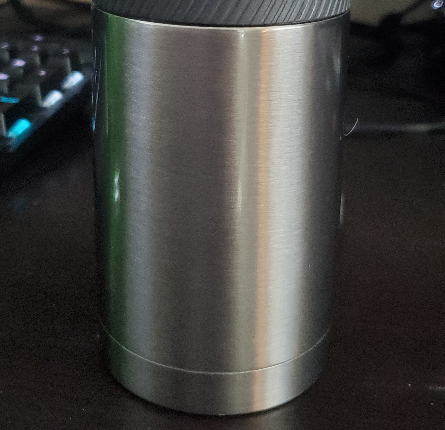
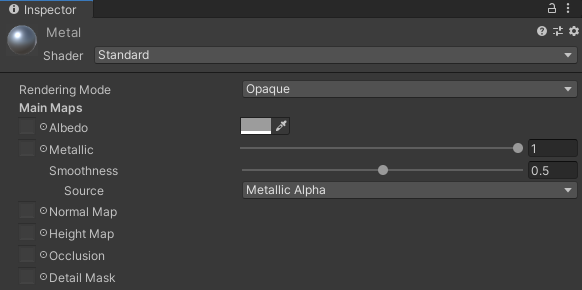
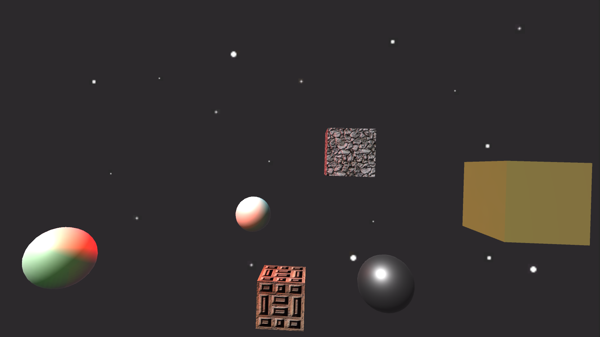
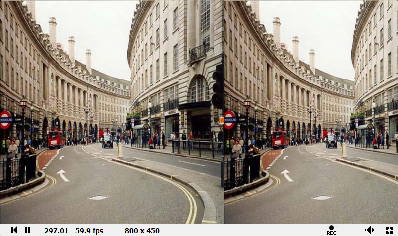

# CMPM163Labs

## <b>Lab 6</b>
### Part 1 Unity
#### Lighting  
Spot Light - Sends light out in a restricted cone from a point in space  
Directional Light - Blankets light over the scene from a given direction  
Point Light - Sends light out in all directions from a point in space   
Area Light - Sends light from a rectangle in one direction  
#### Materials  
  
  
I tried to recreate this cardboard by using a diffuse shader and matching the color.  

  
I also tried to recreate the metal on my water bottle using the standard shader using metallic alpha, and with the Metallic turned to max and smoothness at half.  
#### Textures   
For the textured objects, I reused two of the textures from the free library provided to us a few labs ago, as well as their corresponding normal maps. The textures were of a field of rocks and a wooden pattern. I created materials for them using bumped diffuse shaders, and added the textures to the corresponding fields.
#### Skyboxes
I reused the skybox I created for the last lab, of a starry night. To make this, I created 6 images, each representing a different side of the skybox, then imported them using Unity's built-in utility.  
  
### Part 2 Shadertoy  
  
<b>[My Shadertoy Project](https://www.shadertoy.com/view/wdBBRR)</b>  
<b>[Cool Project I Found](https://www.shadertoy.com/view/3slcWr)</b>

## <b>Lab 5</b>  

<b>[Link to video for Part 1 (Unity)](https://drive.google.com/file/d/1MXvV7zigGS_BIwOGz5jNPGfW4-zUYq99/view?usp=sharing)</b>  

For the Unity project, I added a particle system with orange particles to each of the back wheels on the kart.  
The smaller particles scale up in size with the speed of the kart, while the larger particles are left behind as a sort of trail.  
In addition, I switched the track system from the default oval track to the extended track just outside it, and added a ramp.  
I created my own skybox, and changed the sun model to 80's style using a texture from a free library.  
Finally, I changed the horizon mountains to a wireframe material, and changed the colors of the trees and hills.  
  
  
<b>[Link to video for Part 2a (Particle Universe)](https://drive.google.com/file/d/1WVAzfANfpFkmtTXsbpWw53aB_S5okLJf/view?usp=sharing)  
[Link to video for Part 2b (Particle Explosion)](https://drive.google.com/file/d/15gvVtC_OpPLMY9x_FM7s_b9jzoDUOy64/view?usp=sharing)  
[Link to video for Part 2b (Custom Particle Animation)](https://drive.google.com/file/d/1jq4wkb4TV9JFAAEGQszXzMA2cKw9bJ6F/view?usp=sharing)</b>  

For the custom particle animation, I randomly distributed using the general formula for an Archimedean spiral,  
then tried to move them in a circle to resemble a rotating spiral using derived formulas for circulur motion.  
The motion did not match my expectations, but I kept it as it still is interesting.  

## <b>Lab 4</b>  
a. x = u x 7    
b. y = v x -7 + 7  
c. (2.625,5.25) = gray  

<b>[Link to video](https://drive.google.com/file/d/1bo_ADo5jxJRgCFgc9_9M-fvdPf7ahkXf/view?usp=sharing)</b>  
From left to right:
1. 2nd chosen texture and normal map  
2. 1st chosen texture  
3. 1st chosen texture and normal map  
These three were done in the same way, using three.js built in functionality.  
4. Shader loaded texture  
5. Tiled shader loaded texture  
These two were loaded using shader files. I solved the tile issue by using the built-in mod function.  
For some reason, the tiled cube used the texture file from the first shader cube. Not sure how to fix.

## <b>Lab 3</b>

<b>[Link to video](https://drive.google.com/file/d/1mI6X_eOP5UXOTJIeI3NRfMBDfFhOcWyP/view?usp=sharing)</b>  
Top left     : Basic material with wireframe true and color pink  
Top right    : Normal material  
Center       : Phong material with green specular highlight  
Bottom Left  : Shaders interpolating between default colors and z-axis  
Bottom Right : Shaders interpolating between blue, purple and y-zxis  

## <b>Lab 2</b>

<b>[Link to video](https://drive.google.com/file/d/1NeADZKp8pNPdYFGvxcBc9fCCv-Py1t9W/view?usp=sharing)</b>  

